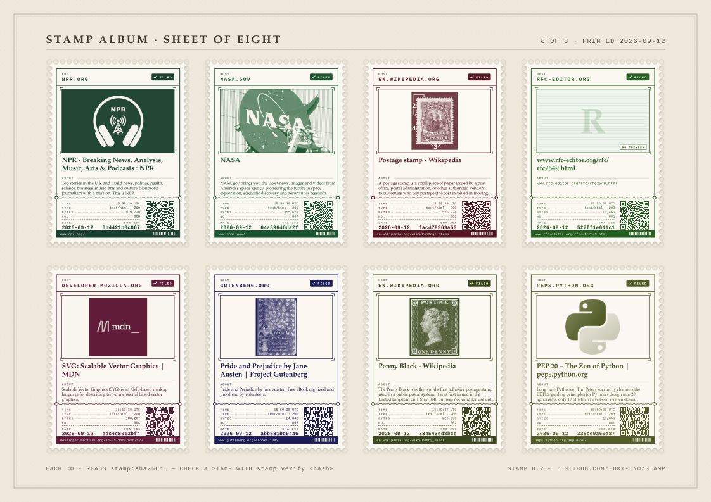
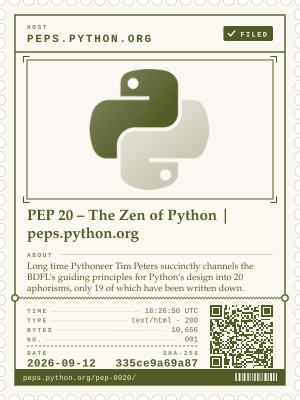

# stamp

**Postage stamps for the web.**

`stamp add URL` fetches a page, files the bytes away under their SHA-256, and
prints a small postage stamp for it: the site's name across the top, an
engraved landscape drawn from the hash, the title, the date, a short hash, and
a QR code that carries the full one. Stamps collect in a local album. When you
have a few, print a sheet of eight and cut along the perforations.

<p align="center">
  
</p>

This is philately, not archiving. It is not a crawler, not a bulk mirror, and
not a notary. It is a stamp album for the pages that mattered to you: the post
that changed your mind, the docs you lived in for a year, the page a friend
made, the front page on the morning something happened.

## Install

Python 3.11 or newer, nothing else. The standard library does all the work,
including the QR codes.

```sh
pip install git+https://github.com/loki-inu/stamp
```

Or, for hacking on it:

```sh
git clone https://github.com/loki-inu/stamp
cd stamp
pip install -e '.[dev]'
pytest
```

## Quickstart

```sh
$ stamp add https://peps.python.org/pep-0020/
stamped  335ce9a69a87  PEP 20 – The Zen of Python | peps.python.org
         ~/.stamp/stamps/335ce9a69a87…d1.svg

$ stamp add en.wikipedia.org/wiki/Penny_Black
stamped  b7334ca03759  Penny Black - Wikipedia
         ~/.stamp/stamps/b7334ca03759…71.svg

$ stamp list
2026-09-12  b7334ca03759  Penny Black - Wikipedia
2026-09-12  335ce9a69a87  PEP 20 – The Zen of Python | peps.python.org

$ stamp verify 335c
ok        335ce9a69a87  bytes still hash to sha256:335ce9a69a87…

$ stamp sheet --paper letter
sheet of 2 stamps (LETTER, landscape) -> ~/.stamp/sheet.svg

$ stamp album
album of 2 stamps -> ~/.stamp/album.html
```

Open `sheet.svg` in a browser and print it; open `album.html` to browse the
collection. Both are plain files that work from `file://` with no server.

<p align="center">
  
</p>

## Commands

| Command | What it does |
| --- | --- |
| `stamp add URL [--title T]` | Fetch the URL, store the bytes and metadata, print a stamp. Same bytes twice gives the same stamp once. |
| `stamp list [--urls]` | Every stamp, newest first: date, short hash, title or URL. |
| `stamp show HASH` | Paths to the stamp, the bytes and the metadata, plus what it knows about the page. |
| `stamp verify HASH` | Re-hash the stored bytes. Exit 0 when they still match, 1 when they do not. |
| `stamp sheet [HASH…] [--out F] [--paper a4\|letter] [--title T]` | Lay up to eight stamps out on a landscape sheet, ready to print and cut. Defaults to the newest eight. |
| `stamp album [--out F]` | Write a static `album.html` gallery of every stamp. |

`HASH` may be any unambiguous prefix, the full hash, or the `stamp:sha256:…`
string a QR code scans to.

## The album on disk

Everything lives in one directory, `~/.stamp` by default, or wherever
`$STAMP_HOME` (or `--home`) points. Nothing else is written anywhere, nothing
phones home, and there is no account to make.

```
~/.stamp/
  objects/<sha256>          the bytes exactly as the server sent them
  stamps/<sha256>.json      url, fetched_at (UTC), sha256, title, content-type, size
  stamps/<sha256>.svg       the stamp
  sheet.svg                 the last printed sheet
  album.html                the gallery
```

Stamps are content-addressed: the name of a stamp is the SHA-256 of the page
bytes. The same page fetched again with identical bytes is the same stamp; a
page that changed gets a new one, which is exactly what a collector wants. The
store is plain files, so `rsync`, `git` or a USB stick are all fine ways to
carry an album around.

## Anatomy of a stamp

Every stamp is a single-colour engraving in the manner of classic definitive
issues. The ink, the horizon, the ridges, the sun and the birds are all read
off the hash, so no two pages get the same picture, and the same page always
gets the same one.

- **Issuing host** across the top, in letter-spaced capitals.
- **The picture**, a hash-derived landscape.
- **Title** of the page, in italics, or the URL when a page has no title.
- **Date** the page was fetched, `YYYY-MM-DD`, in UTC.
- **Short hash**, the first twelve hex digits of the SHA-256.
- **Number and denomination**: the stamp's position in your album and the size of the page.
- **QR code** encoding `stamp:sha256:<full hash>`, so a printed stamp can be looked up again.

Stamps are pure SVG, with no embedded rasters or fonts, so they scale to any
size and print crisply. A sheet uses nested SVGs, so each stamp on it is the
same drawing you would get on its own.

## What it is not

`stamp` keeps the bytes a server handed it over plain HTTP(S) at one moment in
time. It does not run scripts, render pages, save WARC files, fetch images or
stylesheets, or witness anything. A stamp says *I was here, and this is what I
saw*; it is a keepsake, not evidence, and makes no claim to be proof of
anything in any forum. For bulk archiving, use an archiver.

## License

MIT. See [LICENSE](LICENSE).
