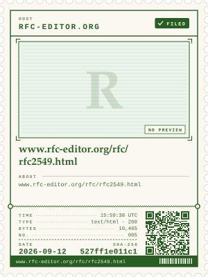

# stamp

**Postage stamps for the web.**

`stamp add URL` fetches a page, files the bytes away under their SHA-256, and
prints a small postage stamp for it. The stamp is laid out like an identity
card for the page: the host and a FILED chip across the top, the page's own
preview picture, its title in large type, a few lines about what it is, then
date, short hash, size and album number beside a QR code that carries the
full hash. Stamps collect in a local album. When you have a few, print a
sheet of eight and cut along the perforations.

<p align="center">
  
</p>

This is philately, not archiving. It is not a crawler, not a bulk mirror, and
not a notary. It is a stamp album for the pages that mattered to you: the post
that changed your mind, the docs you lived in for a year, the page a friend
made, the front page on the morning something happened.

## Install

Python 3.11 or newer. The standard library does the fetching, hashing,
drawing and QR codes. [Pillow](https://python-pillow.org/) is optional: with
it, each page's preview picture is shrunk to a small greyscale JPEG and
printed on the stamp; without it, only pictures that are already small are
embedded and the rest get an empty "NO PREVIEW" slot.

```sh
pip install 'stamp-philately[preview] @ git+https://github.com/loki-inu/stamp'
```

Leave off `[preview]` for the pure standard-library install.

Or, for hacking on it:

```sh
git clone https://github.com/loki-inu/stamp
cd stamp
pip install -e '.[dev]'
pytest
```

## Quickstart

```sh
$ stamp add https://peps.python.org/pep-0020/
stamped  335ce9a69a87  PEP 20 – The Zen of Python | peps.python.org
         ~/.stamp/stamps/335ce9a69a87…d1.svg

$ stamp add en.wikipedia.org/wiki/Penny_Black
stamped  b7334ca03759  Penny Black - Wikipedia
         ~/.stamp/stamps/b7334ca03759…71.svg

$ stamp list
2026-09-12  b7334ca03759  Penny Black - Wikipedia
2026-09-12  335ce9a69a87  PEP 20 – The Zen of Python | peps.python.org

$ stamp verify 335c
ok        335ce9a69a87  bytes still hash to sha256:335ce9a69a87…

$ stamp sheet --paper letter
sheet of 2 stamps (LETTER, landscape) -> ~/.stamp/sheet.svg

$ stamp album
album of 2 stamps -> ~/.stamp/album.html
```

Open `sheet.svg` in a browser and print it; open `album.html` to browse the
collection. Both are plain files that work from `file://` with no server.

<p align="center">
  
  &nbsp;&nbsp;
  
</p>

Left: a page that describes itself with Open Graph tags. Right: a page that
offers nothing but bytes, so the stamp shows its address and an empty slot.

## Commands

| Command | What it does |
| --- | --- |
| `stamp add URL [--title T] [--description D] [--no-preview]` | Fetch the URL, store the bytes and metadata, fetch the page's preview picture, print a stamp. Same bytes twice gives the same stamp once. |
| `stamp list [--urls]` | Every stamp, newest first: date, short hash, title or URL. |
| `stamp show HASH` | Paths to the stamp, the bytes, the metadata and the preview picture, plus what it knows about the page. |
| `stamp verify HASH` | Re-hash the stored bytes. Exit 0 when they still match, 1 when they do not. |
| `stamp sheet [HASH…] [--out F] [--paper a4\|letter] [--title T]` | Lay up to eight stamps out on a landscape sheet, ready to print and cut. Defaults to the newest eight. |
| `stamp album [--out F]` | Write a static `album.html` gallery of every stamp. |
| `stamp redraw [HASH…]` | Draw stamps again in the current design. Bytes, hashes and metadata are untouched; use it after upgrading. |

`HASH` may be any unambiguous prefix, the full hash, or the `stamp:sha256:…`
string a QR code scans to.

## The album on disk

Everything lives in one directory, `~/.stamp` by default, or wherever
`$STAMP_HOME` (or `--home`) points. Nothing else is written anywhere, nothing
phones home, and there is no account to make. The only requests `stamp add`
makes are for the page itself and, when the page names one, its preview
picture.

```
~/.stamp/
  objects/<sha256>              the bytes exactly as the server sent them
  stamps/<sha256>.json          url, fetched_at (UTC), sha256, title, description, content-type, size, preview
  stamps/<sha256>.svg           the stamp
  stamps/<sha256>.preview.jpg   the page's preview picture, shrunk (only when it had one)
  sheet.svg                     the last printed sheet
  album.html                    the gallery
```

Stamps are content-addressed: the name of a stamp is the SHA-256 of the page
bytes. The same page fetched again with identical bytes is the same stamp; a
page that changed gets a new one, which is exactly what a collector wants. The
store is plain files, so `rsync`, `git` or a USB stick are all fine ways to
carry an album around. Albums written by earlier versions read fine; run
`stamp redraw` to give old stamps the current design.

## Anatomy of a stamp

Each stamp is printed in a single ink chosen from its hash, so a sheet has
some variety and the same page always comes out in the same colour. The
layout is fixed, like a card, so the eye knows where to find things.

- **Host** across the top in letter-spaced capitals, and a **FILED** chip.
  FILED means the bytes are filed in your album under their hash; it claims
  nothing about the page's truth or provenance.
- **Preview**: the picture the page advertises for sharing (`og:image`,
  `twitter:image` or `<link rel=image_src>`), printed as a duotone in the
  stamp's ink. Pages without one get a ruled empty slot with the host's
  monogram and a **NO PREVIEW** tag.
- **Title** of the page in large type, or the URL when a page has no title.
- **About**: two or three lines from `og:description`, the meta description,
  or the first real paragraph of the page; failing all of those, the address.
- **Date** the page was fetched, `YYYY-MM-DD`, in UTC; the **SHA-256** short
  hash (first twelve hex digits); the **size** of the page; and the stamp's
  **number** in your album.
- **QR code** encoding `stamp:sha256:<full hash>`, so a printed stamp can be
  looked up again.
- A **footer bar** with the address and a hash-derived set of bars, and a
  dashed tear line above the grid, as on a receipt.

Stamps are SVG, so they scale to any size and print crisply. The only raster
in one is the preview picture, embedded as a small JPEG so the stamp is a
single self-contained file. A sheet uses nested SVGs, so each stamp on it is
the same drawing you would get on its own.

## Regenerating the examples

The pictures in this README are made from live pages by

```sh
sh docs/make-examples.sh
```

which stamps eight public pages into a throwaway album, writes
`docs/example-sheet.svg`, and copies out `docs/example-stamp.svg` (PEP 20)
and `docs/example-stamp-no-preview.svg` (an RFC with no metadata).

## What it is not

`stamp` keeps the bytes a server handed it over plain HTTP(S) at one moment in
time, plus one picture the page pointed at. It does not run scripts, render
pages, save WARC files, fetch stylesheets, or witness anything. A stamp says
*I was here, and this is what I saw*; it is a keepsake, not evidence, and
makes no claim to be proof of anything in any forum. For bulk archiving, use
an archiver.

## License

MIT. See [LICENSE](LICENSE).
